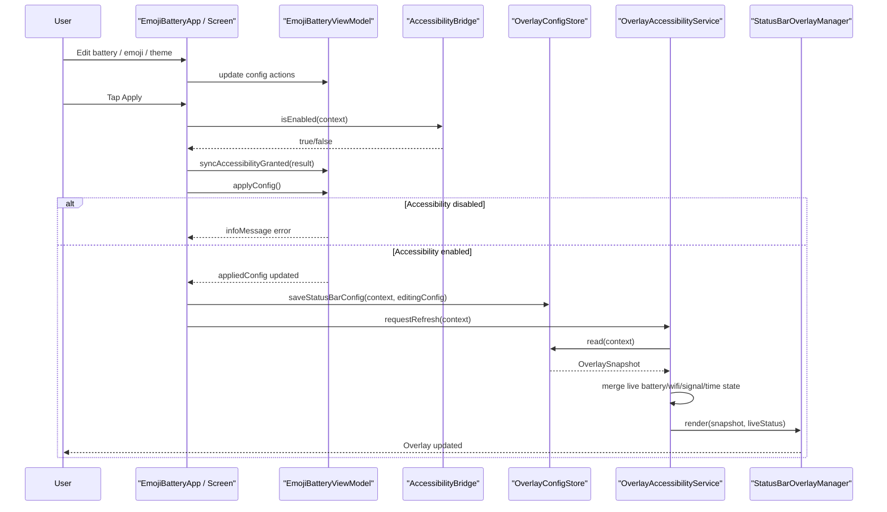
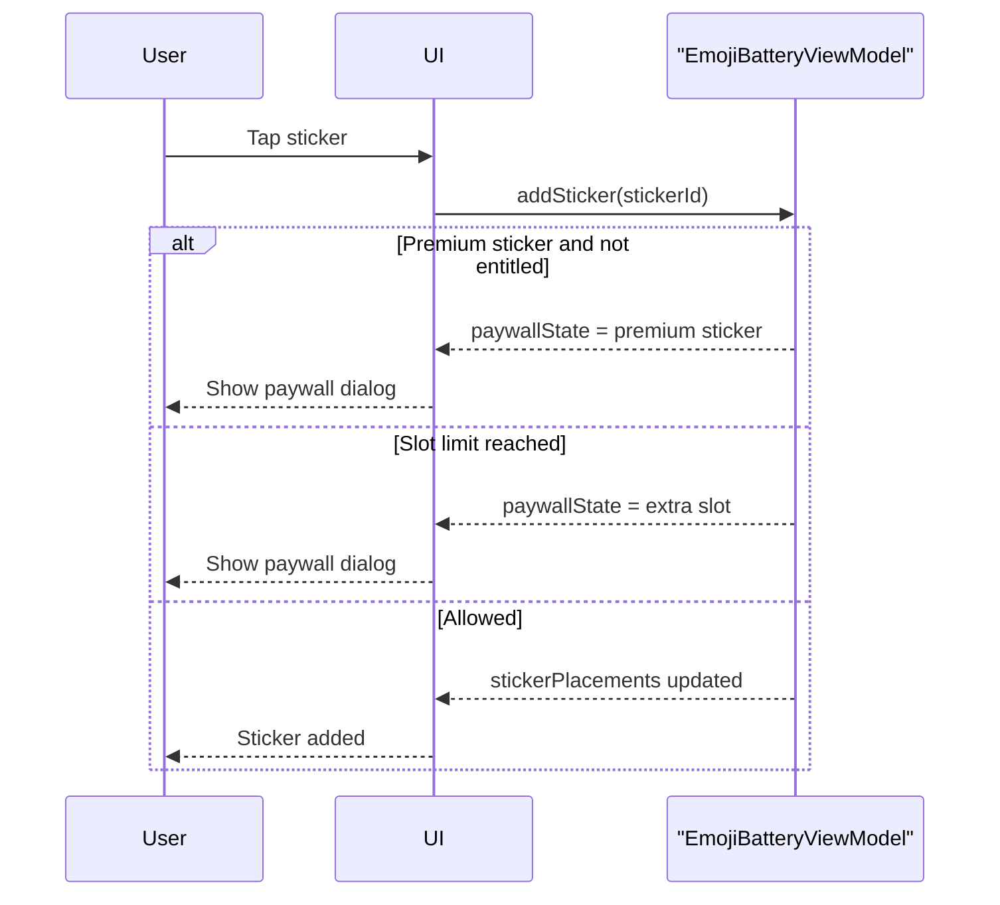
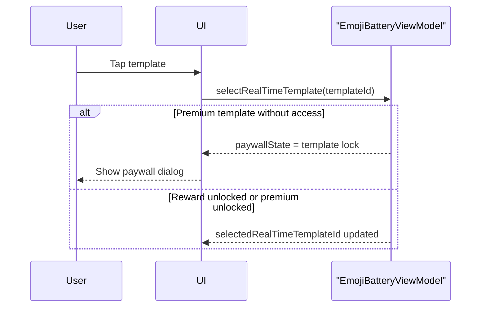
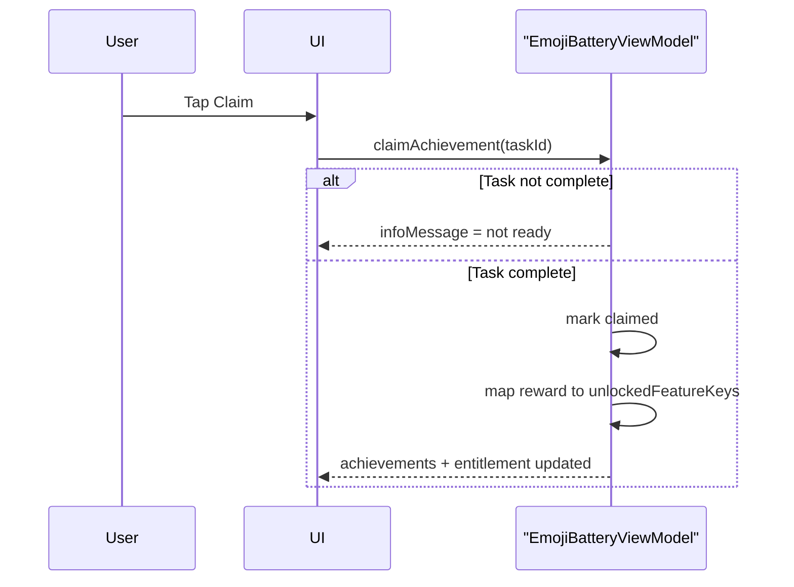
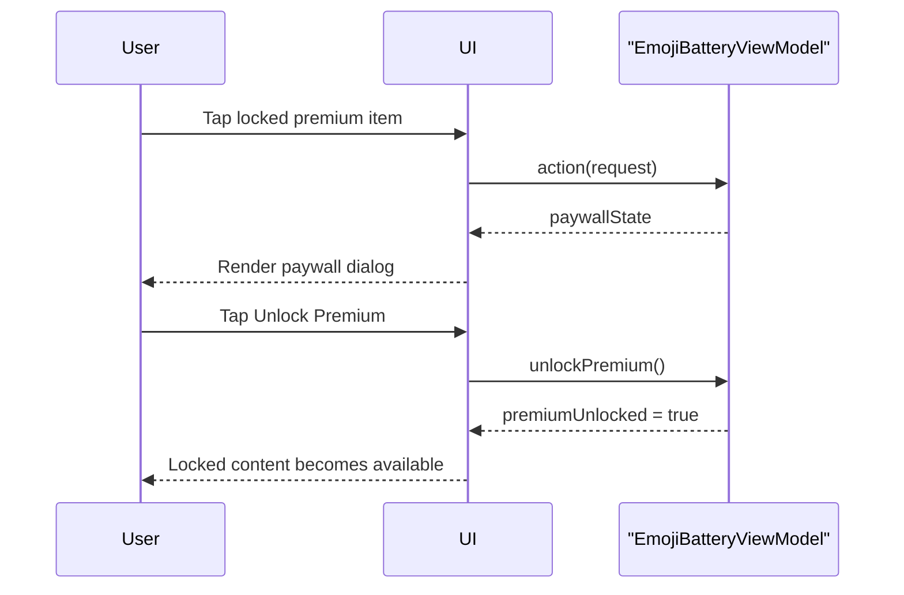

# Sequence Diagram

## 1. Main Status-Bar Apply

## 2. Sticker Add With Lock Condition

## 3. Real-Time Template Select With Reward Unlock

## 4. Claim Achievement Unlock Path

## 5. Premium Purchase Path

